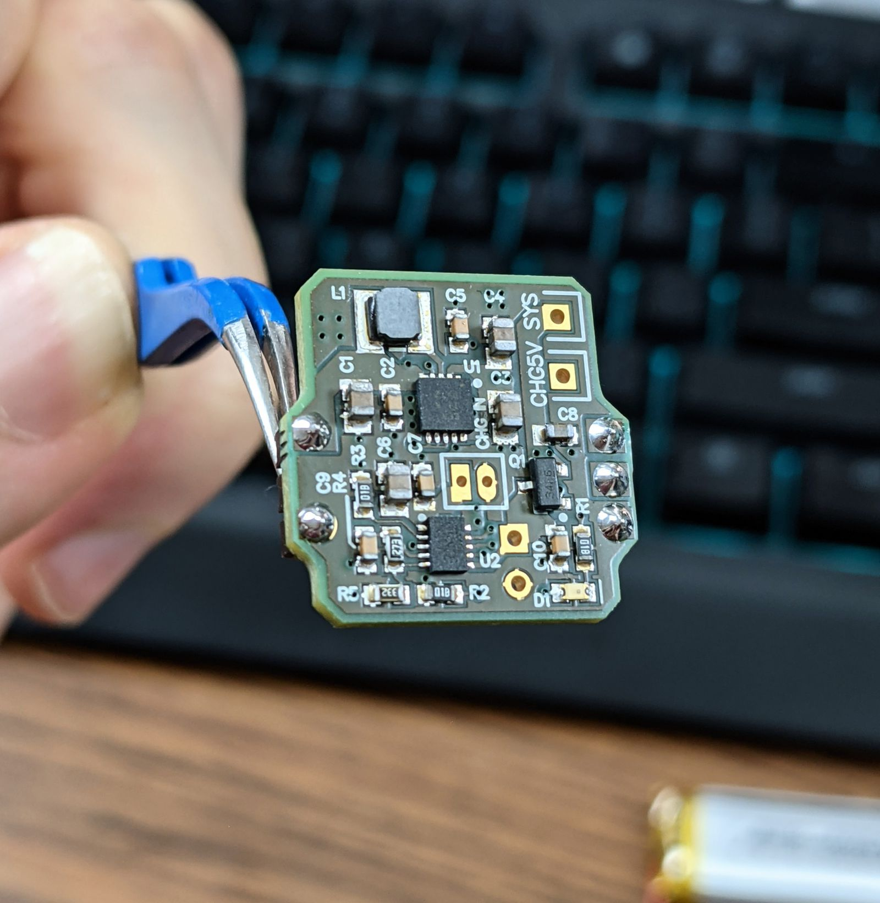
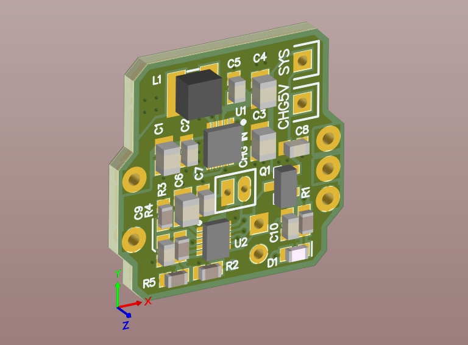
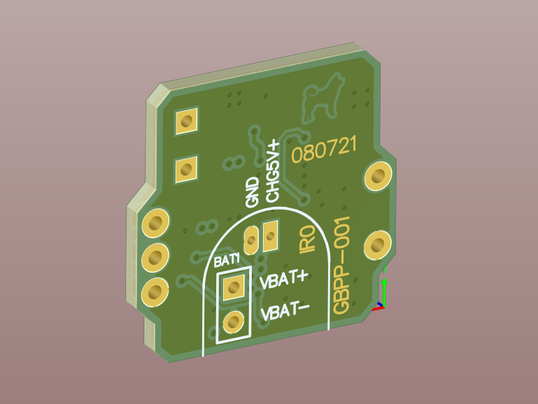
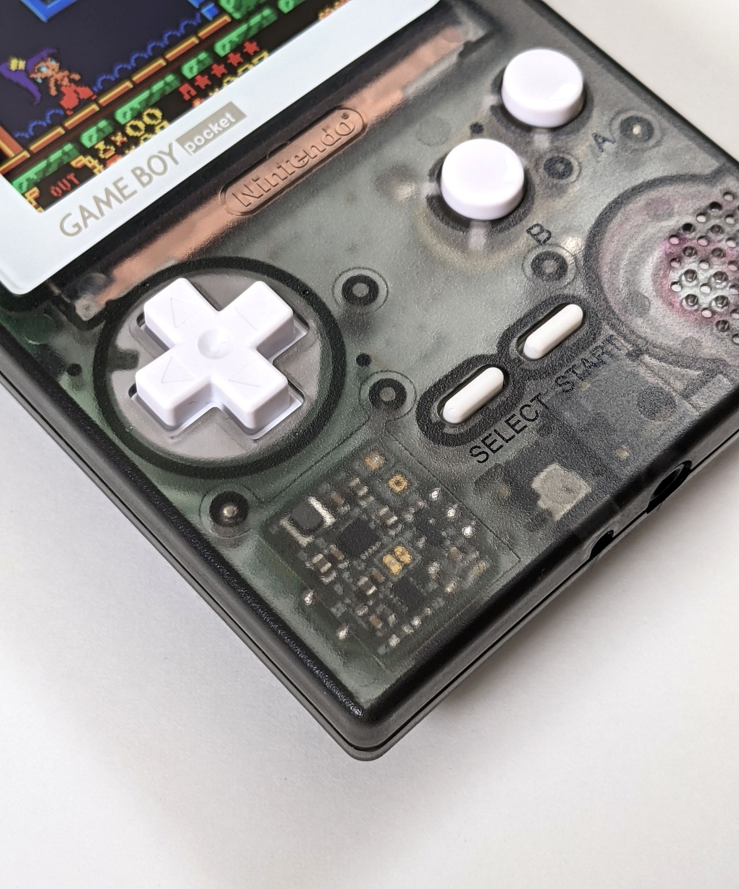
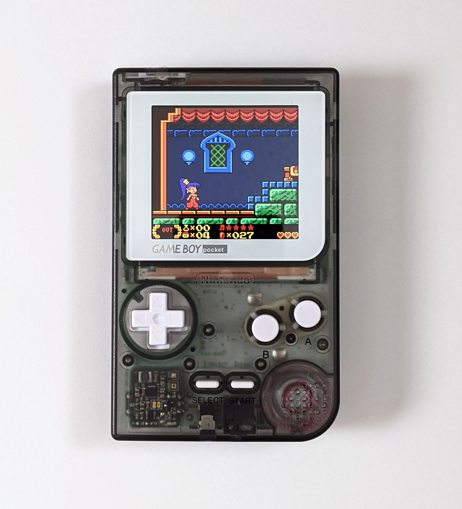

# gbpp
 Replacement power regulator for Game Boy Pocket.
 
 
 
 
 The GBP famously cannot handle running many flash carts reliably. And if you add an IPS mod, it probably won't even boot.
 Now if you use this board, you can run anything you want all at once, and even from a lipo cell.
 
 * Lithium ion cell charge & play support (charge rate: 256mA)
 * Wire up to a 5V source, such as USB-C to charge the battery
 * Charging LED - shuts off when charging is complete
 * Running off original AAA also works but may not handle IPS mods or EZflash because the cells cannot supply enough current
 * Removes LCD Vee supply, so IPS mod is necessary (or make your own -18V regulator)

Please use the zipped gerbers, and buy parts from the BOM. I strongly recommend using a reflow oven to build this, QFNs require it. Hot air may be possible but dicey. Do not try this as your first soldering project.

## Assembly:

1. Use a paste stencil from OSHStencils or a very thin steel stencil. Use leadfree paste and only apply in 1 pass for sharpest transfer
2. Place all parts. Make sure U1 and U2 are not swapped, and pin1 is correct.
3. Reflow up to 230-250C.
4. Solder in two 3-pin male pin headers, one with the middle pin removed via pliers.
5. Solder wires to battery and/or 5v charge source (external usbc port), and solder a wire to connect SYS to the Pocket power input. Do this now as it gets harder once the pcb is soldered in place.
6. Install the pinned PCB into the gameboy pocket PCB.

## Net names:
CHG5V: Solder your 5v source from a USB port here. If you dont' know how to wire a USBC port, refer to the internet. Present on both the front and back of the pcb for easy access.

VBAT+: Lipo battery pos terminal (NOT the AAA battery contacts on the pocket)

VBAT-: Lipo battery neg terminal

SYS: Solder to the power input on the gameboy. The fuse near the headphone jack is the best place to wire this. It should be the same net as the pocket's battery pos terminal.

Note that this board does not provide intrinsic lipo protection. However, almost all cells available already have a BMS board preinstalled.
 

 
 ## Troubleshooting:
 
 When in doubt, consult the original GBP schmatic, and look at the schematic of this board.
 
 I recommend trimming the plastic on the pin headers if the pcb is too close to the pocket plastic shell.
  
 
Here it is installed in the Pocket Color I built

